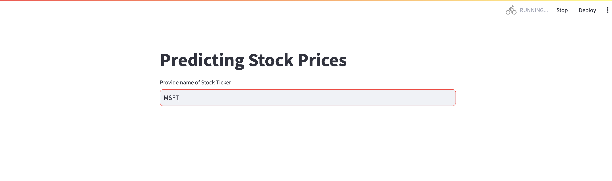
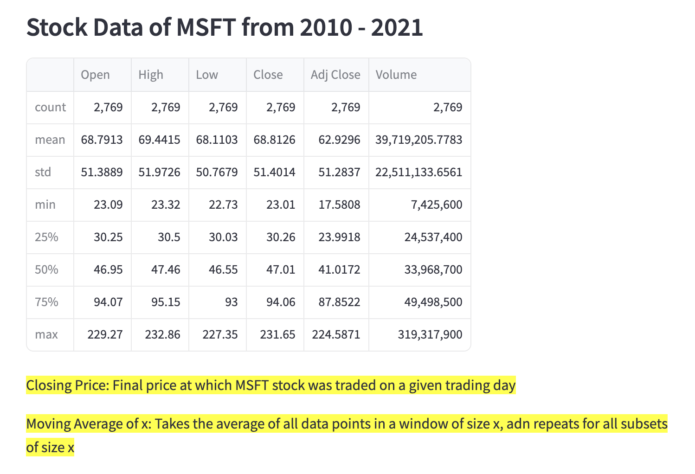
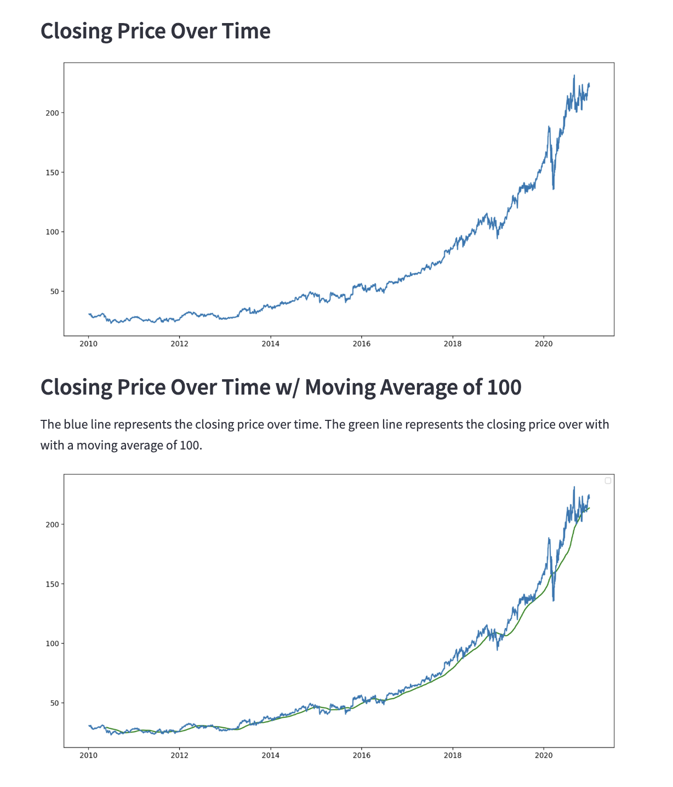
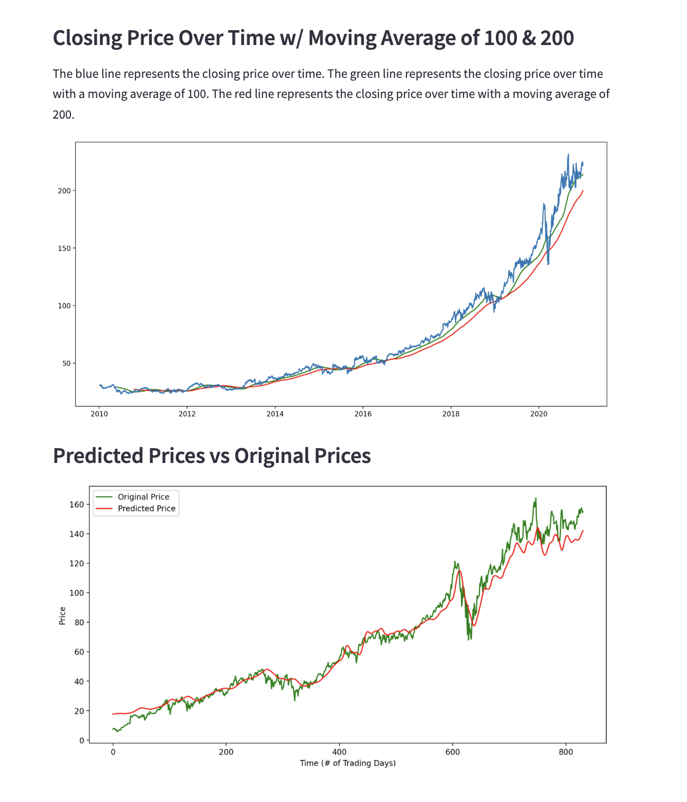

This program uses the LSTM model and the Yahoo Finance API to predict stock prices based on previous stock data. The user can input the name of a stock ticker in the Streamlit app, and see the summarized dataframe, several visualizations about the data, and a graph showing the predicted prices. 

